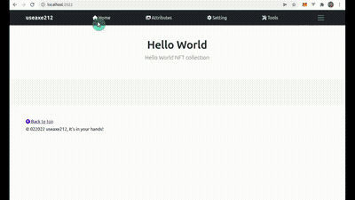

# useaxe212
NFT Collections Tool to generate Images/Animations via browser, set design attribute or layer image, generate image and auto create metadata ready for upload to ipfs (pinata)

### Features:
- Set design attribute base on layers images
- Generate images/animations
- Create metadata 
- Upload to ipfs (pinata)

### In Planing:
- Add tools/information to create a smart contract
### Tutorial [](https://www.youtube.com/watch?v=9owBpSa15aE) please [](https://www.youtube.com/channel/UCFLwu6tx3wDUtPxswHdV_QQ?sub_confirmation=1) to support app updates to make it even better, thanks.





# Requirements:
* nodejs : https://nodejs.org/en/
* ffmpeg : https://ffmpeg.org/


#### Installation nodejs linux:
```sh
$ sudo apt update
$ sudo apt install nodejs
$ node -v
```

#### Installation ffmpeg linux:
```sh
$ sudo apt update
$ sudo apt install ffmpeg
$ ffmpeg -version
```
#### Installation ffmpeg windows:
```sh
- Download https://www.gyan.dev/ffmpeg/builds/ffmpeg-git-full.7z
- Extract file
- Rename folder to ffmpeg
- Move ffmpeg folder to c:\ffmpeg 
- Open cmd as administrator
- Type command: setx /m PATH "C:\ffmpeg\bin;%PATH%"
- Restart computer.
- Open cmd to check ffmpeg status, run the following command: ffmpeg -version
```

# Installation useaxe212

- Download from github repository:
- Extract the archive
- Open terminal/cmd 
- Go to the folder extract file eg: cd d:/useaxes212-master and run the following command: 

```sh
npm install
```
run application
```sh
npm run start
```
open browser and goto [http://localhost:2022](http://localhost:2022/) 


[](https://twitter.com/yussaqnf) [](https://t.me/yussaqnf) [](https://www.youtube.com/playlist?list=PLCv_rFt7G0yOh9bb5oRe2X7FetMKLebwQ) [](https://id.linkedin.com/in/yussaq-nurfitrianto-0923936b) [](https://www.instagram.com/yussaqnf/)
[](https://yussaq-nf.com)


[](paypal.me/yussaq)